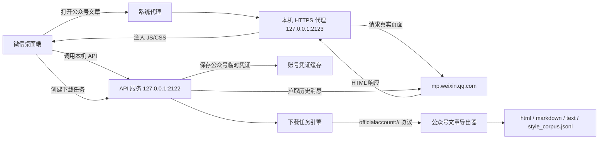
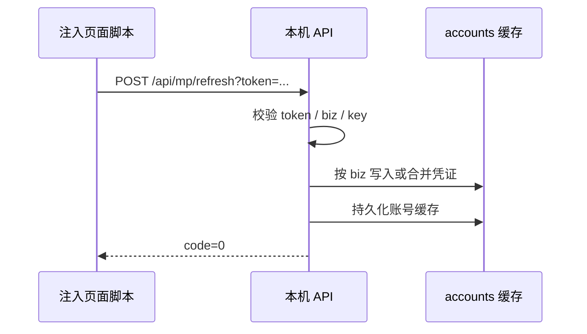
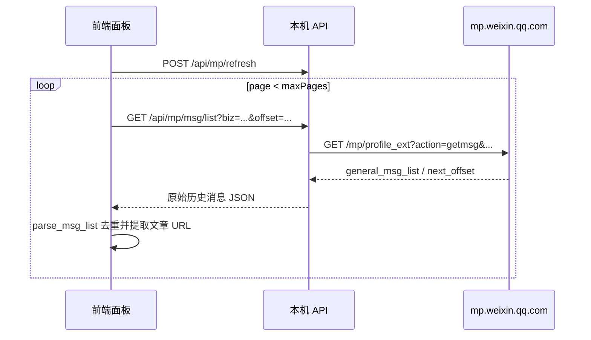
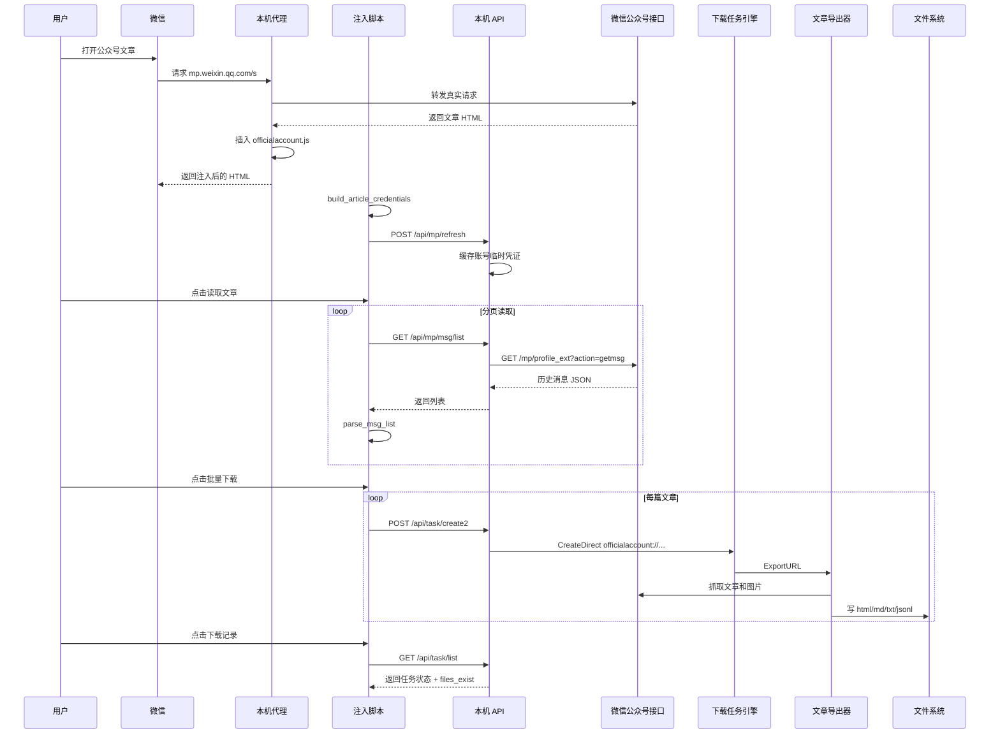

# 公众号文章批量下载器实现原理

这份文档面向后续维护者和学习者，目标不是只说明“怎么用”，而是把这个工具为什么能工作、各模块如何协作、关键数据如何流转、常见限制从哪里来，都讲清楚。

本文中的路径均为项目内相对路径，不包含任何本地个人目录或账号信息。

## 1. 解决的问题

微信桌面端里可以打开任意公众号文章。单篇文章本身是 `mp.weixin.qq.com` 的网页，页面上下文里包含公众号标识、临时访问凭证、文章 HTML、部分全局变量等信息。

这个工具利用这一点做了三件事：

1. 让微信的公众号文章请求经过本机 HTTPS 代理。
2. 在公众号文章 HTML 返回给微信前，向页面注入一个前端面板。
3. 面板读取当前文章页的临时凭证，通过本机 API 拉取该公众号历史文章列表，再逐篇创建下载任务。

最终产物不是只保存一个原始网页，而是按文章输出：

```text
<下载目录>/<公众号名称>/
  html/
    0001-文章标题.html
  markdown/
    0001-文章标题.md
    images/
      ...
  text/
    0001-文章标题.txt
  style_corpus.jsonl
```

## 2. 总体架构

核心架构可以理解为四层：

1. 启动层：加载配置、证书、启动 API 服务和代理服务。
2. 代理注入层：拦截 `mp.weixin.qq.com` HTML 响应，并插入脚本。
3. 页面控制层：注入脚本渲染面板、读取凭证、调用本机 API。
4. 下载导出层：后台创建任务、抓取文章、导出 HTML/Markdown/Text。



## 3. 目录结构

主要目录如下：

```text
.
├── README.md
├── IMPLEMENTATION.md
├── build.sh
├── run.sh
├── config.yaml
└── mp_article_downloader_src/
    ├── main.go
    ├── cmd/
    ├── internal/
    │   ├── api/
    │   ├── config/
    │   ├── interceptor/
    │   └── officialaccount/
    └── pkg/
        └── gopeed/
```

关键文件：

| 文件 | 作用 |
| --- | --- |
| `build.sh` | 编译 Go 二进制 `mp_article_batch_downloader`。 |
| `run.sh` | 用 `sudo` 启动二进制，并指定根目录 `config.yaml`。 |
| `config.yaml` | 配置 API 端口、代理端口、下载目录、公众号功能开关。 |
| `mp_article_downloader_src/cmd/root.go` | 主命令入口，启动 API 服务和代理服务。 |
| `mp_article_downloader_src/internal/officialaccount/plugin.go` | 公众号 HTML 响应注入插件。 |
| `mp_article_downloader_src/internal/interceptor/inject/src/officialaccount.js` | 注入到公众号文章页里的前端面板逻辑。 |
| `mp_article_downloader_src/internal/api/routes.go` | 本机 API 路由注册。 |
| `mp_article_downloader_src/internal/api/handler.go` | 下载任务创建、任务列表、文件存在性检查。 |
| `mp_article_downloader_src/internal/officialaccount/client.go` | 公众号凭证缓存、历史消息接口请求。 |
| `mp_article_downloader_src/pkg/gopeed/internal/protocol/officialaccount/fetcher.go` | `officialaccount://` 下载协议适配。 |
| `mp_article_downloader_src/pkg/gopeed/pkg/officialaccount/officialaccount.go` | 单篇文章抓取和多格式导出。 |

## 4. 启动流程

用户执行：

```bash
./run.sh
```

`run.sh` 实际执行：

```bash
sudo mp_article_downloader_src/mp_article_batch_downloader --config config.yaml
```

需要 `sudo` 的原因是工具要做两件系统级操作：

1. 安装或信任本机根证书，用于 HTTPS 中间人代理解密。
2. 修改系统代理，让微信发出的 HTTP/HTTPS 请求经过 `127.0.0.1:2123`。

Go 程序启动后，入口大致是：

```text
main.go
  -> cmd.Execute
    -> root_cmd.PersistentPreRunE
      -> 加载 config.yaml
      -> 加载证书文件
    -> root_command
      -> 创建 API server
      -> 创建 interceptor/proxy server
      -> 注册 officialaccount 注入插件
      -> 启动所有 server
```

`cmd/root.go` 中的核心职责：

1. 读取配置文件。
2. 判断是否需要管理员权限。
3. 加载证书路径。
4. 创建日志文件 `app.log`。
5. 创建 API 服务。
6. 创建代理服务。
7. 如果 `mp.disabled` 为 false，则注册公众号注入插件。
8. 监听系统信号，在退出时清理代理。

配置中的核心默认值：

```yaml
api:
  hostname: "127.0.0.1"
  port: 2122

proxy:
  system: true
  hostname: "127.0.0.1"
  port: 2123

mp:
  disabled: false
  refreshToken: "mp_article_batch_downloader"
```

## 5. 为什么要做 HTTPS 代理

公众号文章页是 HTTPS 页面。普通脚本无法直接修改微信内置浏览器加载到的页面内容，除非：

1. 页面本身允许扩展注入，这里不成立。
2. 控制微信客户端，这里不现实。
3. 在网络层拦截 HTML 响应并修改后再返回给微信。

本工具采用第三种方案。

代理的工作方式是：

```text
微信请求 https://mp.weixin.qq.com/s?...
  -> 系统代理把请求转给本机代理
  -> 本机代理建立到真实服务器的连接
  -> 本机代理读取真实 HTML 响应
  -> 如果响应满足条件，向 HTML 里插入脚本
  -> 修改后的 HTML 返回给微信
```

这也是为什么首次运行需要安装根证书。没有受信任的本地根证书，本机代理不能让微信接受代理生成的站点证书，HTTPS 解密和注入就无法完成。

## 6. 代理注入逻辑

公众号注入插件位于：

```text
mp_article_downloader_src/internal/officialaccount/plugin.go
```

插件只处理满足以下条件的响应：

1. 公众号功能没有禁用。
2. 请求主机名是 `mp.weixin.qq.com`。
3. 响应 `Content-Type` 包含 `text/html`。

伪代码如下：

```go
if !cfg.Disabled && hostname == "mp.weixin.qq.com" && contentType contains "text/html" {
    html := response body
    nonce := parse CSP nonce if exists
    insertedScripts := build runtime config + utility libs + officialaccount.js
    html = strings.Replace(html, "</body>", insertedScripts + "</body>", 1)
    set response body html
}
```

这里有一个重要细节：有些微信页面会带 CSP nonce。直接插入普通 `<script>` 可能会被 CSP 限制。插件会从 `Content-Security-Policy-Report-Only` 里解析 nonce，并给插入脚本补上同样的 nonce 属性。

注入的内容包括：

1. 运行时配置变量。
2. 通用 UI/工具库。
3. 下载器前端封装。
4. 公众号专用脚本 `officialaccount.js`。

## 7. 为什么公众号首页不能稳定注入

工具能稳定注入的是“公众号文章页”，也就是 `mp.weixin.qq.com/s?...` 这类 HTML 页面。

微信桌面端里的公众号首页通常不是普通网页 DOM。它看起来像网页，但实际可能是微信自己的原生/内部列表容器，或者不是通过 `mp.weixin.qq.com` 的 HTML 响应加载。因此：

1. 代理不一定能看到一个可修改的 HTML 响应。
2. 页面里没有浏览器 DOM 可供脚本插入面板。
3. 右上角菜单也不表现为普通网页菜单。

所以当前产品设计选择：

> 随便打开该公众号的一篇文章，在文章页右下角使用“公众号批量下载”面板。

这不是 UI 没写好，而是入口页面的技术形态不同。

## 8. 页面脚本如何启动

注入脚本位于：

```text
mp_article_downloader_src/internal/interceptor/inject/src/officialaccount.js
```

加载后会执行：

```text
insert_channels_style()
boot_official_account_tools()
DOMContentLoaded 再执行一次
window load 再执行一次
800ms 后兜底检查
2000ms 后兜底检查
每 5 秒兜底检查一次
```

这样做是为了适配微信内置浏览器的页面加载时机。公众号文章页里很多元素和全局变量不是 HTML 一返回就全部存在，所以脚本不能只在最早时机执行一次。

核心分支：

```js
if (location.pathname === "/s") {
  // 公众号文章页
  build_article_credentials()
  connect()
  render_batch_panel()
  insert_download_button()
} else if (location.hostname === "mp.weixin.qq.com") {
  // 其他 mp 页面，尝试兜底渲染
  render_batch_panel(build_page_account())
}
```

实际稳定入口是 `/s` 文章页。

## 9. 页面脚本如何拿到公众号凭证

公众号历史列表接口需要临时凭证。凭证来自文章页上下文，主要由 `build_article_credentials()` 读取：

```js
const params = new URLSearchParams(window.location.search)
const biz = params.get("__biz") || window.biz || window.__biz || ""
```

它会收集：

| 字段 | 来源 | 用途 |
| --- | --- | --- |
| `nickname` | `window.nickname`、`window.cgiData`、`window.cgiDataNew`、`document.title` | 显示公众号名称、默认保存子目录。 |
| `avatar_url` | 页面全局变量 | 账号信息展示。 |
| `biz` | URL 参数或页面全局变量 | 公众号唯一标识。 |
| `uin` | 页面全局变量 | 请求历史消息接口所需参数。 |
| `key` | 页面全局变量 | 请求历史消息接口所需临时 key。 |
| `pass_ticket` | 页面全局变量 | 请求历史消息接口所需参数。 |
| `appmsg_token` | 页面全局变量 | 部分接口需要。 |
| `refresh_uri` | 当前文章 URL | 后续刷新凭证或定位页面。 |

这些值都是微信文章页当前会话里的临时访问凭证。它们不是长期 token，可能过期，所以如果读取失败，刷新文章页通常可以重新拿到。

## 10. 凭证如何提交到本机服务

页面脚本拿到凭证后会调用：

```text
POST /api/mp/refresh?token=<refreshToken>
```

对应后端处理函数：

```text
internal/officialaccount/client.go
  HandleRefreshEvent
```

处理流程：

1. 校验 query 参数里的 `token`。
2. 解析请求体为 `OfficialAccount`。
3. 校验 `biz` 和 `key` 是否存在。
4. 以 `biz` 为 key 写入内存 `accounts` map。
5. 更新 `created_at`、`update_time`、`is_effective` 等状态。
6. 持久化到本地账号缓存文件。
7. 如果有等待这个账号凭证的后台流程，则通知等待者。

这一步是后续 `/api/mp/msg/list` 能工作的前提。

数据流：



## 11. 前端面板做了什么

右下角的“公众号批量下载”面板由 `render_batch_panel(acct)` 创建。

面板包含：

1. 当前公众号名称和 `biz`。
2. 保存子目录输入框，默认是公众号名称。
3. 已有文件处理方式：
   - `已有则跳过`
   - `覆盖重下`
4. 最大读取页数输入框。
5. `读取文章` 按钮。
6. `批量下载` 按钮。
7. `下载记录` 按钮。
8. 状态显示区域。
9. 文章列表或任务列表区域。

面板内部维护状态：

```js
var state = {
  articles: [],
  currentTaskNames: []
}
```

`articles` 保存本次读取到的文章列表。

`currentTaskNames` 保存本次创建或跳过的任务名，用于过滤下载记录，避免把历史任务混进当前结果。

## 12. 历史文章列表如何读取

点击“读取文章”后，前端调用：

```js
fetch_mp_articles(acct, maxPages, onProgress)
```

核心逻辑：

1. 如果有 `biz`，先提交凭证。
2. 从 `offset = 0` 开始分页请求。
3. 每一页调用本机 API：

```text
GET /api/mp/msg/list?biz=<biz>&offset=<offset>
```

4. 后端请求微信历史消息接口。
5. 前端解析返回的 `general_msg_list`。
6. 去重后加入 `articles`。
7. 如果返回 `can_msg_continue` 且 `next_offset` 有效，则继续下一页。
8. 如果历史接口失败且当前页面能扫描到可见文章，则退化为“当前页面可见文章”。

历史消息接口每页通常约 10 篇，但微信返回结构里可能包含多图文，所以实际每页得到的文章数不一定严格等于 10。



## 13. 后端如何请求历史消息接口

后端实现位于：

```text
internal/officialaccount/client.go
```

关键函数：

```text
BuildMsgListURL(acct, offset)
FetchMsgList(biz, offset)
fetchMsgList(logger, biz, offset)
```

请求目标大致是：

```text
https://mp.weixin.qq.com/mp/profile_ext?action=getmsg&__biz=...&uin=...&key=...&pass_ticket=...&count=10&offset=...&f=json
```

这些参数来自之前保存的账号临时凭证。

后端会根据 `biz` 从账号缓存中取出凭证。如果没有对应账号，说明用户还没有打开该公众号文章页，或者凭证还没提交成功，此时会返回账号不存在或凭证缺失类错误。

## 14. 如何从微信返回结构中提取文章

前端函数 `parse_msg_list(data)` 负责把微信历史消息 JSON 转成统一文章数组。

微信历史消息里常见结构：

```text
comm_msg_info
app_msg_ext_info
multi_app_msg_item_list
```

单次群发可能包含一篇主文章和多篇副文章，所以提取时会把：

```js
[app_msg_ext_info].concat(app_msg_ext_info.multi_app_msg_item_list || [])
```

都当作候选文章。

最终每篇文章整理成：

```js
{
  title,
  digest,
  author,
  url,
  publishTime
}
```

其中 `url` 会做规范化：

1. `&amp;` 还原成 `&`。
2. `//mp.weixin.qq.com/...` 补成 `https:`。
3. `/s?...` 补成 `https://mp.weixin.qq.com/s?...`。

## 15. 批量下载任务如何创建

点击“批量下载”后，前端按文章顺序逐篇调用：

```js
create_article_task(article, index, dir, onExists)
```

请求后端：

```text
POST /api/task/create2
```

请求体大致是：

```json
{
  "url": "officialaccount://https://mp.weixin.qq.com/s?...",
  "filename": "0001-文章标题",
  "dir": "公众号名称",
  "on_exists": "skip",
  "extra": {
    "title": "文章标题",
    "source": "mp-batch-panel",
    "publish_time": "发布时间"
  }
}
```

几个设计点：

1. `url` 使用 `officialaccount://` 前缀，目的是让下载引擎选择公众号文章专用 fetcher。
2. `filename` 不带扩展名，因为后续会生成三种格式：`.html`、`.md`、`.txt`。
3. `dir` 是公众号子目录名，最终会拼到全局下载目录下。
4. `on_exists` 控制重复处理策略。

文件名生成规则在前端 `safe_filename()` 中完成：

1. 替换路径非法字符。
2. 空白折叠成 `-`。
3. 去掉首尾 `-`。
4. 限制最大长度。
5. 加上四位序号前缀，如 `0001-标题`。

## 16. 后端任务创建和去重策略

任务创建入口：

```text
internal/api/handler.go
  handleCreateDownloadTask
```

后端会先计算：

```text
taskPath = DownloadDir + Dir
taskName = Filename 去掉扩展名
articleID = ExtractArticleID(URL)
```

`articleID` 用于识别同一篇公众号文章。通常由文章 URL 里的 `mid` 和 `idx` 等信息组成。

去重分两层：

### 16.1 已有任务去重

遍历当前下载任务列表，如果发现：

1. 同一个 `article_id`。
2. 同一个目标目录。
3. 同一个任务名。

则根据 `on_exists` 和文件是否存在决定：

| 情况 | 行为 |
| --- | --- |
| `on_exists=skip` 且文件存在 | 返回 409，前端记为跳过。 |
| `on_exists=overwrite` | 删除旧任务，重新创建。 |
| 旧任务存在但目标文件不存在 | 删除旧任务，重新创建。 |

### 16.2 已有文件去重

如果任务列表里没有旧任务，但目标目录里已经有产物，后端也会检查：

```text
html/<taskName>.html
markdown/<taskName>.md
text/<taskName>.txt
```

当三类文件之一已经存在且不是覆盖模式，会返回“目标目录已存在该文章文件”。

这个逻辑解决了之前“任务显示 done，但目录里没有实际文件”一类状态不一致问题。

## 17. 下载任务列表如何显示进度

前端点击“下载记录”会请求：

```text
GET /api/task/list?status=all&page=1&page_size=1000
```

后端返回任务列表时，会额外给每个任务补充：

```json
{
  "files_exist": true,
  "expected_files": [
    ".../html/0001-title.html",
    ".../markdown/0001-title.md",
    ".../text/0001-title.txt"
  ]
}
```

前端显示时不是只看下载引擎里的任务状态，还会结合 `files_exist`：

1. 如果 `files_exist=true`，显示为 `done`。
2. 如果任务状态是 `done` 但 `files_exist=false`，显示“文件不存在”。
3. 如果任务正在运行，显示进度、已下载大小、总大小、速度。
4. 如果当前批次有 `currentTaskNames`，只显示本批次任务。

这让用户看到的是“实际产物是否落盘”，而不是单纯的任务内部状态。

## 18. `officialaccount://` 协议如何接入下载引擎

下载任务创建后，底层下载引擎根据 URL scheme 选择 fetcher。

公众号协议实现位于：

```text
pkg/gopeed/internal/protocol/officialaccount/fetcher.go
```

它注册的协议名是：

```go
func (fm *FetcherManager) Name() string {
    return "officialaccount"
}
```

并通过 filter 匹配：

```go
Pattern: "officialaccount"
```

流程分两步：

### 18.1 Resolve

`Resolve(req)` 会：

1. 去掉 `officialaccount://` 前缀，恢复真实 HTTP URL。
2. 抓取文章一次，用于获取文章标题和估算大小。
3. 统计正文长度和图片 HEAD 大小。
4. 写入下载引擎的资源元信息。

这一步主要用于任务列表展示资源名、总大小等。

### 18.2 Start

`Start()` 会异步执行：

```go
ExportURL(realURL, targetPath, baseName, needCompress)
```

其中：

1. `realURL` 是真实公众号文章 URL。
2. `targetPath` 是目标公众号目录。
3. `baseName` 是不带扩展名的文件名。
4. `needCompress` 控制图片压缩，目前默认 false。

任务完成后通过 `DoneCh` 通知下载引擎。

## 19. 单篇文章如何导出三种格式

文章导出实现位于：

```text
pkg/gopeed/pkg/officialaccount/officialaccount.go
```

核心函数：

```go
ExportURL(url, dirPath, baseName, needCompress)
```

流程：

```text
FetchArticle(url)
  -> 解析文章标题、作者、发布时间、正文 HTML、图片列表
  -> BuildHTMLFromArticle
  -> ConvertHtmlToMarkdownFile
  -> articlePlainText
  -> appendArticleJSONL
```

导出目录：

```go
htmlDir := filepath.Join(dirPath, "html")
markdownDir := filepath.Join(dirPath, "markdown")
textDir := filepath.Join(dirPath, "text")
```

输出文件：

```text
html/<baseName>.html
markdown/<baseName>.md
text/<baseName>.txt
style_corpus.jsonl
```

### 19.1 HTML

HTML 输出通过 `BuildHTMLFromArticle(article, needCompress)` 生成。

目标是保存一个可读、可归档的文章页面，而不是只保存微信原始片段。它会把解析到的文章信息和正文 HTML 包装成完整 HTML 文档。

### 19.2 Markdown

Markdown 输出通过 `ConvertHtmlToMarkdownFile(article, markdownPath)` 生成。

转换时会处理正文里的图片，把图片下载到 Markdown 目录下的 `images/` 子目录，并让 Markdown 引用本地图片。

### 19.3 Text

纯文本输出通过 `articlePlainText(article)` 生成。

用途是快速检索、做语料处理、做后续文本分析，避免再从 HTML 或 Markdown 里剥离格式。

### 19.4 style_corpus.jsonl

`style_corpus.jsonl` 是按行追加的 JSONL 文件，每篇文章一行。记录结构包含：

```json
{
  "title": "标题",
  "author": "作者",
  "url": "文章 URL",
  "publish_time": "发布时间",
  "text": "纯文本内容",
  "html_path": "html/0001-title.html",
  "markdown_path": "markdown/0001-title.md",
  "text_path": "text/0001-title.txt"
}
```

它适合后续做风格分析、语料整理、批量导入其他系统。

## 20. 为什么要处理 sudo 文件归属

工具通常通过 `sudo` 启动，因为要设置系统代理和证书。这样一来，如果下载文件也由 root 写入，普通用户后续可能无法删除、移动或编辑。

为了解决这个问题，导出完成后会调用：

```go
chownToSudoUser(...)
```

它读取环境变量：

```text
SUDO_UID
SUDO_GID
```

如果存在，就把导出的目录和文件 `chown` 回原始登录用户。

这一步对 macOS 使用体验很重要，否则下载目录里会出现 root 拥有的文件。

## 21. 本地数据文件

运行时会生成一些本地状态文件。这些文件不应该提交到仓库。

| 文件 | 说明 |
| --- | --- |
| `app.log` | 运行日志。可能包含请求错误、公众号名称等信息。 |
| `mp.json` | 公众号凭证缓存。包含临时凭证，必须本地保存，不应公开。 |
| `gopeed.db` | 下载任务数据库。包含本地任务记录和路径。 |
| 构建二进制 | 本地构建产物，不应提交。 |

根目录 `.gitignore` 已经忽略这些文件。

## 22. 安全边界

这个工具只应该在用户自己的电脑上本地运行。

需要特别理解几个安全点：

1. 工具会设置系统代理，所有系统代理流量都可能经过本机代理。
2. 工具会安装本机根证书，这是 HTTPS 解密的前提。
3. 公众号文章页里的 `key`、`uin`、`pass_ticket`、`appmsg_token` 都是临时敏感凭证。
4. `mp.json`、`app.log`、`gopeed.db` 不能提交到公开仓库。
5. 不建议把 API 服务暴露到公网。
6. 不要把自己的公众号凭证、Cookie、下载记录、日志给别人。

从实现上看，API 默认绑定 `127.0.0.1`，这是正确的。除非明确知道风险，不要改成 `0.0.0.0`。

## 23. 和其他代理软件的关系

工具启动后会把系统代理设置到：

```text
127.0.0.1:2123
```

如果同时运行其他会修改系统代理或 TUN 的软件，可能出现：

1. 系统代理被互相覆盖。
2. 微信请求没有经过本工具。
3. 本工具流量又被转发到其他代理，引起连接异常。
4. 证书或 HTTPS 握手失败。

使用建议：

1. 使用本工具时暂停其他系统代理或 TUN。
2. 退出本工具后再恢复其他代理。
3. 如果端口被占用，先查并结束旧进程。

## 24. 典型完整流程

下面是一篇文章触发批量下载的完整链路：



## 25. 关键接口速查

### 25.1 公众号凭证刷新

```text
POST /api/mp/refresh?token=<refreshToken>
```

用途：页面脚本把当前公众号文章页里的临时凭证提交给本机服务。

### 25.2 历史消息列表

```text
GET /api/mp/msg/list?biz=<biz>&offset=<offset>
```

用途：根据已缓存凭证，请求微信历史消息接口。

### 25.3 创建下载任务

```text
POST /api/task/create2
```

用途：创建单篇文章下载任务。

### 25.4 下载记录

```text
GET /api/task/list?status=all&page=1&page_size=1000
```

用途：查询任务列表、进度和实际文件是否存在。

### 25.5 WebSocket

```text
GET /ws/mp
GET /ws/downloader
```

用途：页面与本机服务保持连接、任务事件推送等。

## 26. 调试方法

### 26.1 看代理是否注入

终端里出现类似日志：

```text
[mp inject] mp.weixin.qq.com /s
```

说明代理确实拦截到了公众号文章 HTML，并执行了注入逻辑。

如果打开公众号首页没有日志，但打开文章有日志，说明首页不是当前代理可注入的 HTML 页面。

### 26.2 看 API 是否启动

```bash
curl http://127.0.0.1:2122/api/status
```

如果连接失败，先确认进程是否还在、端口是否被占用。

### 26.3 看公众号是否已缓存

```bash
curl http://127.0.0.1:2122/api/mp/list
```

如果列表没有目标公众号，通常表示还没有打开过该公众号文章页，或者注入脚本没有成功提交凭证。

### 26.4 看任务记录

```bash
curl 'http://127.0.0.1:2122/api/task/list?status=all&page=1&page_size=20'
```

重点看：

1. `status`
2. `progress`
3. `files_exist`
4. `expected_files`
5. `meta.opts.path`
6. `meta.opts.name`

### 26.5 看本地日志

运行日志在：

```text
app.log
```

日志可能包含公众号名称、错误原因、请求失败信息等，公开前必须删除。

## 27. 常见问题背后的实现原因

### 27.1 为什么必须先打开一篇文章

因为文章页里有当前公众号的 `biz` 和临时凭证。只打开公众号首页通常拿不到这些网页上下文变量，也无法稳定注入前端脚本。

### 27.2 为什么读取页数不是最终文章数

读取页数是历史消息接口的分页次数。每页通常约 10 条消息，但一条消息可能是一组多图文，可能包含多篇文章。因此最终文章数不严格等于 `页数 * 10`。

### 27.3 为什么有时需要刷新文章页

临时凭证会过期。刷新文章页可以让微信重新生成页面上下文和可用凭证，注入脚本再提交一次。

### 27.4 为什么任务状态要结合文件是否存在

下载引擎内部状态有时不能完全代表文件系统最终状态。例如旧任务记录还在，但文件被手动删除。`files_exist` 能让 UI 以真实落盘结果为准。

### 27.5 为什么下载目录按公众号名称分层

如果多个公众号都下载到同一目录，只靠序号和标题容易冲突，也不利于归档。按公众号名称建子目录后，任务过滤、覆盖策略、后续整理都更清晰。

## 28. 扩展点

### 28.1 增加新的导出格式

位置：

```text
pkg/gopeed/pkg/officialaccount/officialaccount.go
```

可以在 `ExportURL` 中新增：

1. 新目录创建。
2. 新文件路径。
3. 新格式转换函数。
4. 写文件。
5. 更新 `ArticleExportRecord`，如果希望 JSONL 记录新路径。
6. 更新 `taskOutputFilesExist`，让任务状态能检查新产物。

### 28.2 修改前端面板

位置：

```text
internal/interceptor/inject/src/officialaccount.js
```

常见修改点：

1. `render_batch_panel`：改 UI。
2. `fetch_mp_articles`：改读取策略。
3. `create_article_task`：改任务参数。
4. `fetch_task_records`：改记录过滤和展示。
5. `safe_filename`：改文件名规则。

### 28.3 修改任务去重策略

位置：

```text
internal/api/handler.go
```

重点函数：

1. `handleCreateDownloadTask`
2. `taskOutputFilesExist`

如果要改成“同一文章不同目录也算重复”，就要调整 `sameTarget` 的判断。如果要允许不同格式单独重下，就要调整 `expected_files` 的判断。

### 28.4 支持远端服务

当前默认是本地使用。代码里保留了远端服务、Cloudflare Worker、管理页等能力，但对普通本地批量下载不是必需。

如果要做远端模式，需要重新审视安全边界：

1. 凭证传输。
2. API 认证。
3. 日志脱敏。
4. 网络暴露范围。
5. 多用户隔离。

## 29. 开发验证清单

修改代码后建议至少跑：

```bash
./build.sh
node --check mp_article_downloader_src/internal/interceptor/inject/src/officialaccount.js
mp_article_downloader_src/mp_article_batch_downloader --help
```

手动验证建议：

1. 启动工具。
2. 打开微信公众号任意文章页。
3. 确认终端出现 `[mp inject] mp.weixin.qq.com /s`。
4. 确认右下角面板出现。
5. 读取 1 到 2 页文章。
6. 下载少量文章。
7. 检查 `html/`、`markdown/`、`text/` 是否都有文件。
8. 检查 Markdown 图片是否落到 `markdown/images/`。
9. 检查 `下载记录` 是否显示真实文件存在状态。
10. 退出工具，确认系统代理恢复。

## 30. 设计取舍

### 30.1 为什么不做公众号首页按钮

因为首页不是稳定的可注入 HTML 页面。强行做首页按钮需要转向 macOS 原生悬浮窗、辅助功能自动化或微信 UI overlay，复杂度和脆弱性都会明显上升。

当前选择“文章页入口”是因为：

1. 技术路径稳定。
2. 能拿到必要凭证。
3. 用户操作成本很低，只需随便打开一篇文章。
4. 不需要控制微信原生 UI。

### 30.2 为什么下载任务逐篇创建

逐篇创建看起来慢一点，但好处是：

1. 每篇都有独立状态。
2. 可以单篇失败、单篇重试。
3. 可以精准去重。
4. 下载记录更清楚。
5. 不需要一次性把大量文章塞进一个长任务。

### 30.3 为什么输出 HTML、Markdown、Text 三份

三种格式服务不同场景：

| 格式 | 适合场景 |
| --- | --- |
| HTML | 保留原始排版和结构，适合浏览和归档。 |
| Markdown | 适合二次编辑、知识库导入、静态站点。 |
| Text | 适合搜索、语料分析、风格学习、批处理。 |

### 30.4 为什么保留 JSONL

JSONL 是机器处理友好的索引和语料格式。每行一篇文章，追加写入，适合后续做：

1. 风格分析。
2. 向量化。
3. 搜索索引。
4. 训练或微调前的数据整理。
5. 文章清单生成。

## 31. 维护注意事项

1. 不要提交 `app.log`、`mp.json`、`gopeed.db`。
2. 不要把 API 默认绑定从 `127.0.0.1` 改成公网地址。
3. 不要在日志里输出完整 `key`、`pass_ticket`、`appmsg_token`。
4. 改前端面板后一定跑 `node --check`。
5. 改 Go module 或 import 后一定跑 `./build.sh`。
6. 改导出格式后要同步更新 `taskOutputFilesExist`。
7. 改文件名规则后要考虑已有文件和历史任务兼容。
8. 改代理注入逻辑时要注意 CSP nonce。
9. 改系统代理逻辑时要验证退出后的恢复行为。
10. 对微信页面结构的依赖都可能随微信版本变化，需要保留兜底和错误提示。

## 32. 一句话总结

这个工具的本质是：

> 用本机 HTTPS 代理把公众号文章页变成一个可控入口，借文章页里的临时凭证读取历史文章，再把每篇文章交给自定义下载协议导出成可长期保存和二次处理的本地文件。
