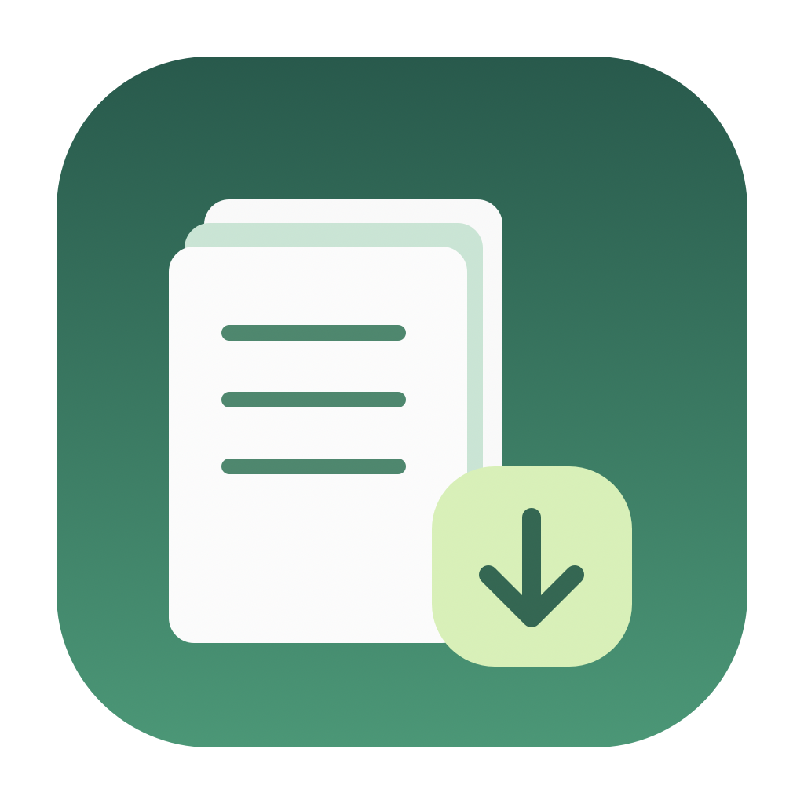
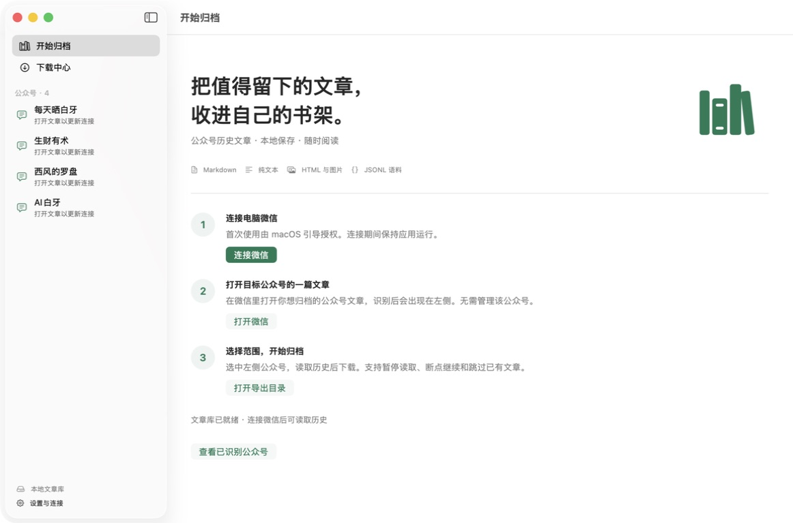

<p align="center">
  
</p>

<h1 align="center">公众号文章下载器</h1>

<p align="center">在 Mac 上读取并批量归档任意可访问微信公众号的历史文章，保存为 Markdown、HTML、纯文本和 JSONL 语料。</p>

<p align="center">
  <a href="https://github.com/dingaiminGIT/wechat-article-batch-downloader/releases/latest/download/MPArticleDownloader-macOS-arm64.zip"><strong>下载 macOS 应用</strong></a>
  ·
  <a href="DESKTOP.md">安装说明</a>
  ·
  <a href="https://github.com/dingaiminGIT/wechat-article-batch-downloader/releases">全部版本</a>
</p>

> 当前应用支持 macOS 14 及以上、Apple Silicon。安装包尚未经过 Apple 公证，第一次打开时请按下文完成系统确认。



## 它解决什么问题

微信公众号适合阅读，却不适合整理大量历史内容。公众号文章下载器把“逐篇打开、复制、保存图片、整理文件名”变成一次本地归档：在电脑微信里打开目标公众号任意一篇文章，应用即可读取该公众号当前账号有权访问的历史列表，并把文章批量保存到 Mac。

它不要求你管理目标公众号，适合个人资料备份、写作研究、知识库整理和 AI 语料准备。

## 主要功能

- **读取全部历史**：支持最近文章、全部历史和日期范围，读取中可暂停并从断点继续。
- **四种本地输出**：每篇文章同时生成 Markdown、HTML 和 TXT，并维护一份去重的 `style_corpus.jsonl`。
- **正文与图片一起保存**：Markdown 引用本地图片，HTML 保留排版并可离线打开。
- **安全 / 快速模式**：安全模式适合大批量长期归档；快速模式遇到短暂访问验证会自动降速重试。
- **跳过已有文章**：使用稳定文章标识去重，重复下载时可跳过或覆盖。
- **清楚的下载中心**：按公众号显示 `已完成/总数`、失败数、开始与结束时间、总耗时和平均速度。
- **一个公众号一个目录**：目录直接使用公众号名称，可从应用一键在 Finder 中打开。
- **后台静默运行**：不再弹出终端窗口；关闭主窗口后仍可继续下载。

## 下载与安装

### 1. 下载

[**下载公众号文章下载器 for macOS（Apple Silicon）**](https://github.com/dingaiminGIT/wechat-article-batch-downloader/releases/latest/download/MPArticleDownloader-macOS-arm64.zip)

下载后解压，把“公众号文章下载器”拖入“应用程序”目录。

### 2. 第一次打开

当前版本没有 Apple 公证。如果 macOS 阻止打开：

1. 在 Finder 中尝试打开一次应用。
2. 打开“系统设置 → 隐私与安全性”。
3. 在安全提示旁点击“仍要打开”。

应用第一次连接微信时，会请求信任一张仅在本机生成的连接证书。这一步需要输入管理员密码；证书保持不变时，后续连接不需要重复授权。

### 3. 开始归档

1. 在应用中点击“连接微信”。
2. 在电脑微信里打开目标公众号任意一篇文章。
3. 回到应用，从左侧选择识别到的公众号。
4. 选择“全部历史”或其他范围，点击“读取文章”。
5. 选择安全或快速模式，开始下载。
6. 在“下载中心”查看进度，完成后点击“打开目录”。

公众号历史接口使用微信文章页里的临时凭证。凭证失效时，重新在微信中打开该公众号的一篇文章即可更新连接。

## 实测速度

在同一台 Apple Silicon Mac 上完整归档“每天晒白牙”210篇文章：

| 模式 | 结果 | 总耗时 | 平均速度 |
|---|---:|---:|---:|
| 安全模式 | 210/210 | 3分35秒 | 约58.6篇/分钟 |
| 快速模式 | 210/210 | **1分53秒** | **110.7篇/分钟** |

实际速度受文章图片数量、网络状况和微信访问限制影响。快速模式出现短暂访问验证时会自动降速重试；持续受限时会暂停剩余任务，避免产生大量失败记录。

## 输出目录

默认保存到：

```text
~/Downloads/公众号文章归档/<公众号名称>/
├── html/                 # 保留排版的离线 HTML
├── markdown/             # Markdown 正文
│   └── images/           # 本地图片
├── text/                 # 纯文本
└── style_corpus.jsonl    # 一行一篇，适合检索、分析和 AI 处理
```

## 隐私与安全

- 所有文章和图片保存在本机，应用没有账号系统，也不会上传你的文章库。
- 本地 API 只监听 `127.0.0.1`，并限制微信文章页和回环地址来源。
- 每台 Mac 会生成独立证书与私钥，私钥不随安装包或源码分发。
- 退出应用会结束后台服务并恢复连接前的系统代理配置。
- 工具不会绕过付费墙；未购买、已删除或被微信限制的内容无法保证导出。

请只归档你本人有权访问的内容，并遵守版权、平台规则和适用法律。

## 从源码构建

需要 Xcode、Swift 6 和 Go 1.20 或更新版本：

```bash
git clone https://github.com/dingaiminGIT/wechat-article-batch-downloader.git
cd wechat-article-batch-downloader
./script/build_and_run.sh --install
```

构建与验证细节见 [macOS 应用说明](DESKTOP.md)、[实现说明](IMPLEMENTATION.md)和[实机验证记录](VERIFICATION.md)。原命令行入口仍保留给需要自行配置端口和运行方式的用户。

## 许可

本项目是在 `wx_channels_download` 基础上继续开发的衍生作品，沿用上游的 **Commons Clause + MIT** 条款。源码可以查看、修改和非商业使用，但禁止将软件或实质相似的服务用于销售。完整条款见 [LICENSE](LICENSE)。
